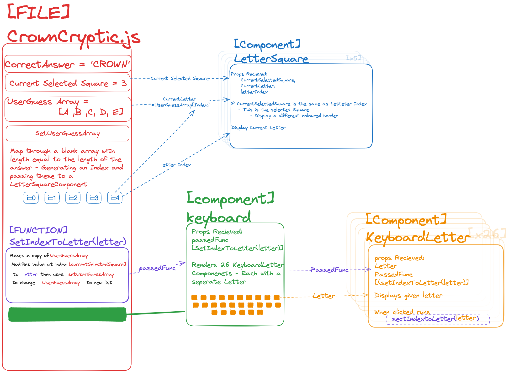

# Crown Cryptic

Crown Cryptic is an in development web application designed to challenge users with a daily cryptic crossword clue. Inspired by the success of word-based games like Wordle, Crown Cryptic provides a fun and engaging way to solve cryptic crossword clues every day. 

This project is a collaboration between [Sam Ford](https://github.com/Fordcois) & [Rachel Roberts](https://github.com/Rachel853).

You can explore our design and planning documents here:

- [Live Design Document](https://hackmd.io/@cXzrcJerTQGszfvObYAayQ/CrownCrypticDesign)
- [Figma Mock-ups](https://www.figma.com/proto/MU6UagXDGSGhVlMFicNLFC/Crown-Cryptic?node-id=1-5&t=ta966i64D5ILQSvX-1)
- <details>
    <summary>Architecture Planning Diagram</summary>
    
    
  </details>


## Getting Started

1. Clone the Repository

```bash
git clone https://github.com/Fordcois/crown-cryptic.git
```
2. Install Dependencies

```bash
npm install
```
3. Start the Development Server

```bash
npm run dev
```
4. Open http://localhost:3000 in your browser to see the application in action.

## Future Development Tasks


### Share Button
A key part of the site is shareability, allowing users to share their results with friends and generate visibility for the site. We envision a shareable graphic for communication apps, similar to the following:
```
I Solved Crown Cryptic 09/07
🟦🟨🟦🟨🟦
🅰️ 2 Letters Given
🔍 Clue Used
www.CrownCryptic.Com
```

The squares represent the length of the word, given letters, and clues used.

We are currently using a library for this functionality although due to changes in the popularity of sites and limited options for custom designs we want to look at constructing our down share component.

### Keyboard Input
Currently, input is received via an on-screen keyboard made of separate components. It is worthwhile to explore enabling physical keyboard input when the application is used on desktop. Research is needed to determine how this can be implemented, particularly to prevent the mobile phone keyboard from appearing when the site is viewed on mobile devices.

### Store Progress in Cookies
Currently, progress is wiped when the page is reloaded, which is not ideal for a game that focuses on sharing results. To improve this, we can store each day's puzzle progress in a cookie, ensuring that the puzzle is only playable once.

### Streak Option
A way to track the users current streak of solving the daily progress

### Expand Daily Questions
Instead of having a single question each day, we can introduce a small grid with multiple questions to provide a more engaging and varied experience. This can also although for a daily theme 

## Development Log

<details>
<summary><b>28th July</b></summary>

**Displaying a Different Question Each Day**: The main feature of our site is to display a different question each day. Although we have a large dataset (and a method to clean it), we initially lacked a way to rotate the questions daily. We solved this by using simple calculations based on dates.

We use two dates: the date the site goes live and today's date. In JavaScript, these are stored as millisecond values. By subtracting the site's start date from today's date, we obtain the number of milliseconds that have passed. We then floor divide this by the number of milliseconds in a day (86,400,000) to count how many days have passed. This number is used as an index for our JSON dataset, enabling easy and automatic updating of the displayed questions.

We also added some smaller features to improve the site's usability, particularly for deleting a word:

**Clear Button**: The Clear button completely wipes the word, apart from the given letters. It also resets your selected square to the earliest available square.

**Keyboard Delete Button**: The Keyboard Delete button deletes the last letter in the word and moves the cursor backward. This is an enhancement of the typing function. If the deleted letter is blank, the cursor moves backward instead of forward, with consideration for 'locked-in letters'.

While these features are smaller in scope than some of our previous developments, they significantly enhance the intuitive nature of the site, which is the driving force behind our design.
</details>

<details>
<summary><b>13th July</b></summary>

Session's focus was on developing the clue features for the game. This involved implementing the features themselves and considering UX elements, such as making revealed letters unselectable.

**Definition**: The daily puzzle clue involves revealing the definition. This is managed by a function that extracts the CLUE and DEFINITION from the JSON file. It separates them into three distinct strings: `questionPreDef`, `questionDef`, and `questionPostDef`. The Pre and Post segments have regular CSS applied, while the Definition segment can optionally have a RevealedDefinition CSS class applied depending on the status of `showDefinition`.

**Letters**: Implemented a system allowing users to use a letter clue to reveal the currently selected letter. Letters given are now unchangeable and cannot be manually selected or selected by the cursor. This is achieved by storing the indices of revealed letters in an array. This array allows us to quickly check if a given index is already revealed.

Upon completion of the puzzle the length of the lettersGiven Array as well as the status of `showDefinition` is passed through which forms part of the score.

**moveCurrentSelectedSquareBy**: This function was now abstracted from the previous `setUserGuessArrayIndexToLetter` making the checking of RevealedLetters easier but also allowing for the development of the Delete function.

</details>

<details>

<summary><b>9th July</b></summary>

**Organize Storage of Questions, Answers, and Clues as JSON**: Created a structured way to store questions, answers, and clues in JSON format.

**Clue Implementation**: Users can request a clue, which provides them with the definition.

**Solved Puzzle Pop-up Display**: A pop-up appears when the puzzle is solved, showing how many clues and letters were used to get the correct answer.

</details>

<details>
<summary><b>7th July</b></summary>

**User Guess Storage** Stored the user's guess as an array of letters. The keyboard, once implemented, should update the corresponding index in this array based on the currently selected number or state.

**Submit and Check Answer** Added functionality to convert the `userGuessArray` into a string upon submission. This string is then compared with the `CorrectAnswer`. If they match, a boolean is set 

**Create Keyboard & Letter Components** Developed the on-screen keyboard and individual letter components to facilitate user input. Implemented functionality to ensure that selecting a letter on the keyboard updates the `currentSelectedSquare` and increments the `currentSelectedSquare` index accordingly.

</details>